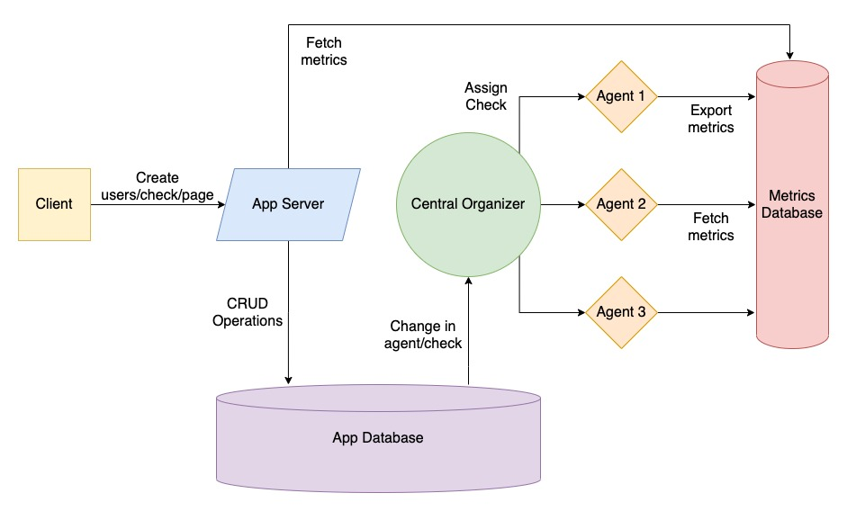

# Architecture

> **Note:** This document also acts as a guideline for components being
> developed.

To understand how Pinger works internally, first, we need to understand
exactly what Pinger does. We will dive into all the components and
understand various aspects and how the deployment can be scaled for all of
them.
   
## Key Terms

Before we begin with the explanation, let's get familiar with some terms
that might be frequently used:

- **Check:** Anything that can be pinged. _Say, pinging google.com using_
  _HTTP protocol and checking for status code 200._
- **Metric:** Result of a ping. _Whether google.com returned status 200_
  _in reasonable time or not._                        
- **Controller:** Something that runs a specific task again and again at
  regular intervals of time.                            
- **Manager:** Manages multiple controllers together and collects
  statistics from each of them.                             
- **Page (or Status Page):** A collection of various checks and their corresponding
  metrics.                                              

## Overview

Pinger will typically be deployed in one of the two modes:

- **Standalone:** An _agent_ deployed on a single node to execute checks
  and collect metrics. A status page can be deployed as well. Everything
  is configured via a configuration file.
- **Complete Application:** Includes user auth, a dedicated dashboard to
  manage checks, pages, etc. Supports distribution of load over multiple
  nodes. Comprises multiple components that we will understand in this
  section.

> **Note:** In this section we will mainly focus on the architecture of
> the complete application, since, standalone mode is simply one
> component, _the agent_, interacting with a database. Anyways, we will
> still go into depth of [agent](./the-agent.html) which will give you a
> better overview of how standalone mode actually works.

A typical user would create their account, create a few checks, and then
create status pages comprising those checks. Creating a page, or adding an
incident to a page is not a complicated task, rather a simple CRUD
operation. The difficult part is creating a check. That's because once a
check has been created in the database we also need to execute it. A
check is like a cron job that keeps on running forever at regular 
intervals. We would usually want to distribute the load of checks on 
various nodes, so, separating this component makes sense. This component
is called an **agent.**

There can be multiple agents distributed across various nodes, and hence,
we would need a central entity to balance the load among the agents. The
**central organizer** is responsible for distributing checks among the
various agents.

We also need an API server to interact with the user dashboard, or what
we call, a **client.** An **app server** does exactly that.

## Flow of a request

Let's take the example of creating a check. **Client** requests the **app**
**server,** which inserts the check into **app database.** As we remember,
inserting into the database isn't enough for a check. We need check to run,
indefinitely. One choice could have been to just spawn a controller for
the check. The problem would be that we couldn't have been able to scale
or distribute checks over multiple nodes. So what we do instead is keep
dedicated **agents** on multiple nodes, which in hindsight, are just a
wrapper around a _manager of controllers for checks._

We want things to be atomic, i.e., checks should be assigned to agents when
created in the database. We also need to balance the load between all the
nodes and assign checks accordingly. Both the aforementioned reasons result
in an independent entity which can accept new checks from the database
and assigns them to the agent. It's the **central organizer.**

We also need to store the metrics. Usually the database we need to store
metrics and application data would be different for two reasons:

1. We would store metrics in a time-series database and not every general
   purpose database supports high performance time series queries.
1. We want to scale the metrics database much differently than the app
   database.
   
So an overview of our deployment would look something like:

We'll now dive into each component individually to analyse how they
function.
