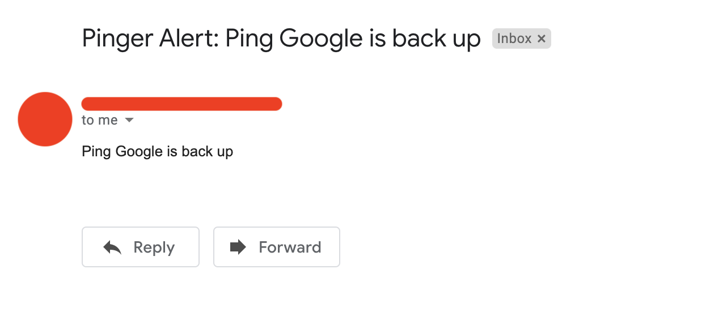

# Mail on Check Failure

Pinger can send alerts when a check fails, or when a check comes back from
the dead.

## Updating the check

Previously we set a timeout for `0.5s` which rarely timed out. Let's change
it to `0.1s` to encounter more failures.

```yaml
# agent.yml

# ...

checks:
  - id: ping-google
    name: Ping Google
    interval: 3s
    timeout: 0.1s
    input:
      type: ICMP
    output:
      type: TIMEOUT
    target:
      type: ADDRESS
      value: google.com

# ...
```

Let's run the check and see if we encountered any failures:

```shell
$ path/to/pinger agent
```

After a few seconds, let's query our database for metrics.

```shell
# In the postgres shell
$ SELECT * FROM metrics;
  check_id   | check_name  |          start_time           | duration  | timeout | success
-------------+-------------+-------------------------------+-----------+---------+---------
...
 ping-google | Ping Google | 2020-12-29 19:58:54.686244+00 |  43848273 | f       | t
 ping-google | Ping Google | 2020-12-29 19:58:57.686358+00 | 100000000 | t       | f
 ping-google | Ping Google | 2020-12-29 19:59:00.685532+00 |  45252482 | f       | t
 ping-google | Ping Google | 2020-12-29 19:59:03.682839+00 |  44708297 | f       | t
 ping-google | Ping Google | 2020-12-29 19:59:06.681564+00 | 100000000 | t       | f
 ping-google | Ping Google | 2020-12-29 19:59:09.683893+00 |  73249643 | f       | t
...
```

Looks like we did encounter a few failures. Amazing. Let's set up an alert
now.

## Adding sender's information

We need to inform Pinger about the account from where to send the emails.
This means you need to provide an email and password in configuration file.
I'll be using my personal Gmail account for this.

```yaml
# agent.yml

# ...

alerts:
  - service: mail
    host: smtp.gmail.com # Since I'll be using a Gmail Account
    port: 587
    user: <email>
    secret: <password>
```

Replace the `<email>` and `<password>` with your email account and password
respectively.

> **Note:** You might need to turn on ***Less Secure App Access*** in your
> Google account security settings.

Once done, we can add a mail alert to our check.

## Setting alert for the check

In the check configuration, we need to add what alerts are required to be
sent.

```yaml
# agent.yml

# ...

checks:
  - # ...
    alerts:
      - service: mail
        target: <email> # For now just send the mail to yourself

# ...
```

We can now start our agent and see if we get any mail.

## Checking mails

Start the agent again and look for any new mails from yourself.

```shell
$ path/to/pinger agent
```

Open up your mail, and you'll see one like this:



> **TODO:** An email is sent each time the agent is re-started. Rather,
> what should happen is, we should fetch the previous state, if any, from
> the database and then see if we want to alert the user.
