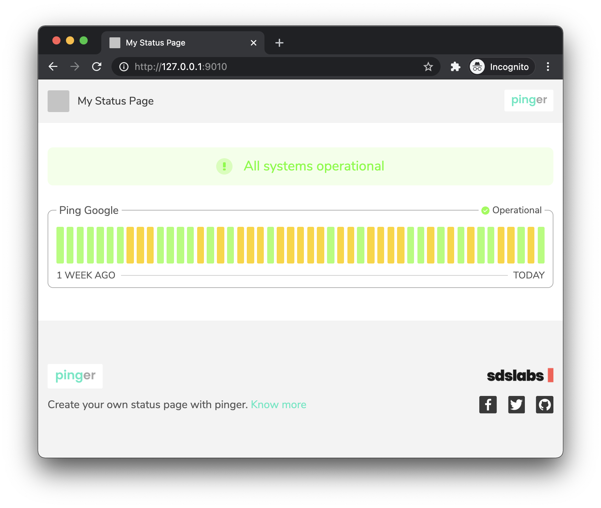

# Deploying a Status Page

Deploying a status page is quite easy. We just need to set a boolean equal
to `true`, and set a couple other variables.

## Configuration

Add the following to the configuration file.

```yaml
# agent.yml

# ...

page:
  deploy: true
  allowed_origins: ['*'] # For now allow every origin
  name: My Status Page
```

## Seeing metrics on browser

Open up your browser and visit
[http://127.0.0.1:9010/](http://127.0.0.1:9010/) and you'll be greeted by a
beautiful status page displaying metrics for your check.



Similarly, we can add more checks to our config, and they'll magically
appear on the status page. We can also configure the logo and favicon of
the status page. Use [this config reference]() on how to do it.
<!-- TODO(vrongmeal): Fix the link once config references are added -->

We have finally created a status page, and it was super easy. Let's
continue this journey with one of the coolest features – alerts.
