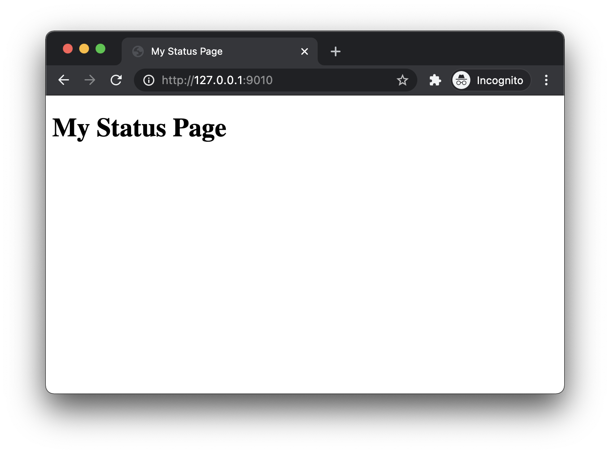
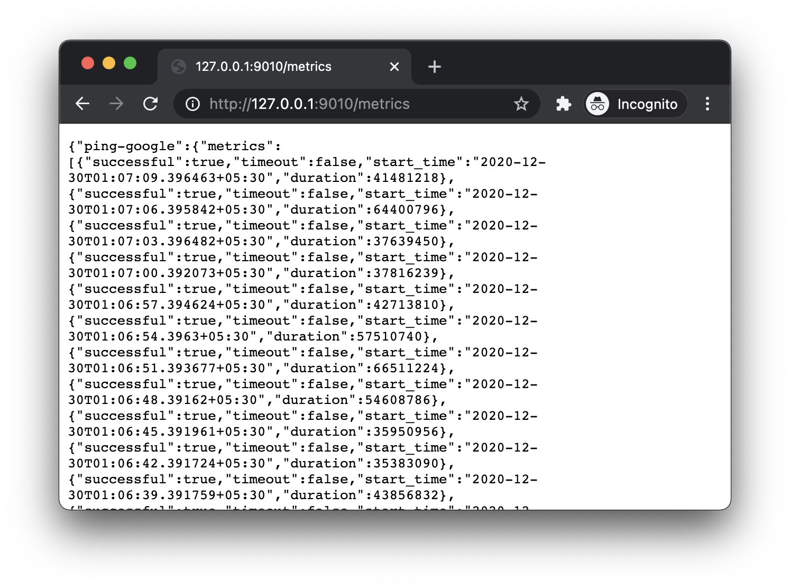

# Deploying a Status Page

Deploying a status page is quite easy. We just need to set a boolean equal to
`true`, and set a couple other variables.

## Configuration

Add the following to the configuration file.

```yaml
# agent.yml

# ...

page:
  deploy: true
  allowed_origins: ['*'] # For now allow every origin
  name: My Status Page
```

## Seeing metrics on browser

> **TODO:** Frontend of the metrics is still in development. We can verify
> the working of status page using the API endpoint it exposes and a very
> bare-bone template it renders on request.

Open up your browser and visit
[http://127.0.0.1:9010/](http://127.0.0.1:9010/) and you'll be greeted by a
screen shouting the words `My Status Page`.

.

To look at the metrics returned by the server, visit
[http://127.0.0.1:9010/metrics](http://127.0.0.1:9010/metrics). You'll see
a messed up JSON in your browser. Don't worry, soon the frontend will make
sense of that data and will render a beautiful status page.

.

We have finally created a status page, and it was super easy. Let's
continue this journey with one of the coolest features – alerts.
